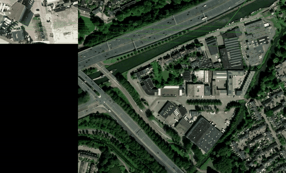

[](./demo_video_2025-10-10_13-49-10_compressed.mp4)

[Watch the full demo video](./demo_video_2025-10-10_13-49-10_compressed.mp4)

# Drone Visual Navigation

Research prototype for visual navigation from drone imagery. The code focuses on
feature matching, homography estimation, optical flow utilities, and image/video
processing helpers for matching drone frames against reference imagery.

This public branch intentionally excludes private datasets, generated demo
outputs, cached features, and local presentation scripts. The reusable computer
vision modules are kept under `src/dvn`.

## Project Status

This is an experimental research codebase, not a polished production library.
The public tree is intended to show the core implementation ideas while keeping
large local assets and unfinished demo scaffolding out of the repository.

## Installation

Python 3.11 is required.

```bash
python3 -m venv .venv
source .venv/bin/activate
pip install -e .
```

Some video utilities require FFmpeg:

```bash
sudo apt update
sudo apt install ffmpeg
```

## Local Data Layout

Datasets, model weights, generated outputs, and cached features are not tracked
in git. For local experiments, place them under:

```text
data/
  images/
  videos/
  models/
  output/
```

These paths are defined in `src/paths_.py`. The package can be imported without
the data folders present, but functions that load local images, videos, or model
weights expect those assets to exist.

## Main Components

- `src/dvn/models/xfeat_`: XFeat-based feature detection and matching helpers.
- `src/dvn/models/optical_flow`: optical-flow model wrapper and visualization utilities.
- `src/dvn/models/depth_estimation`: depth-estimation experiment utilities.
- `src/dvn/utils`: image, video, geometry, homography, and visualization helpers.
- `src/dvn/combined_logic`: higher-level feature-matching logic with optional filtering.

## Notes

The project depends on third-party research models and libraries. Model weights
are downloaded or supplied locally depending on the module being used. Review the
upstream model licenses before redistributing weights or generated artifacts.